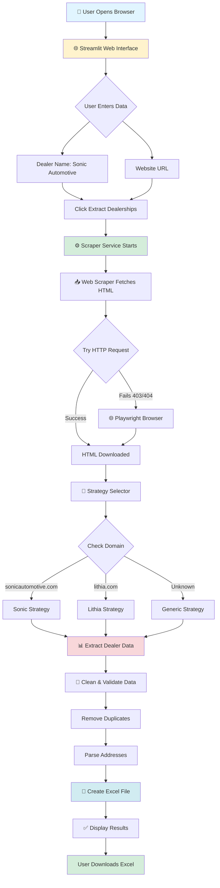
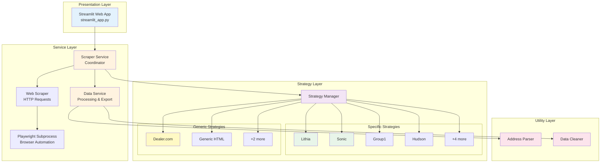
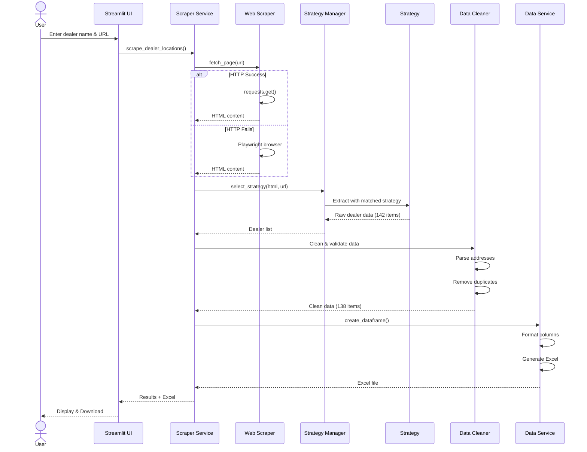
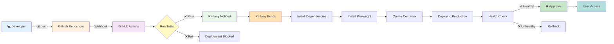
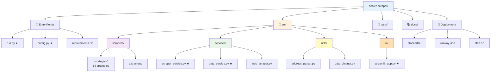
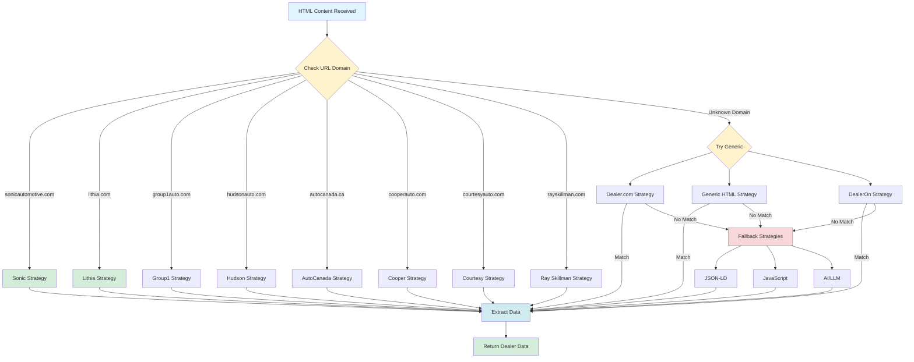
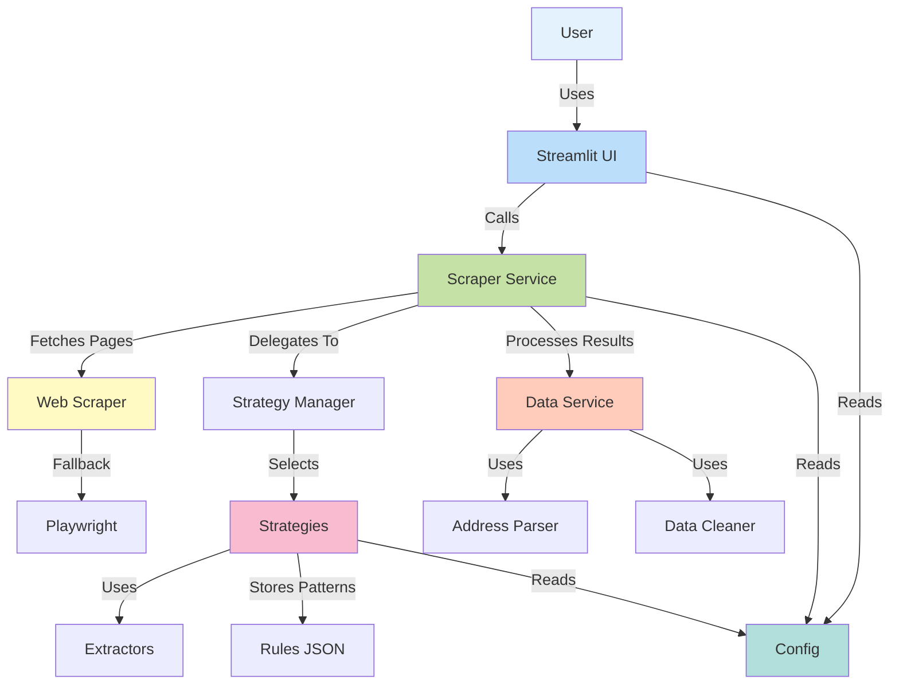
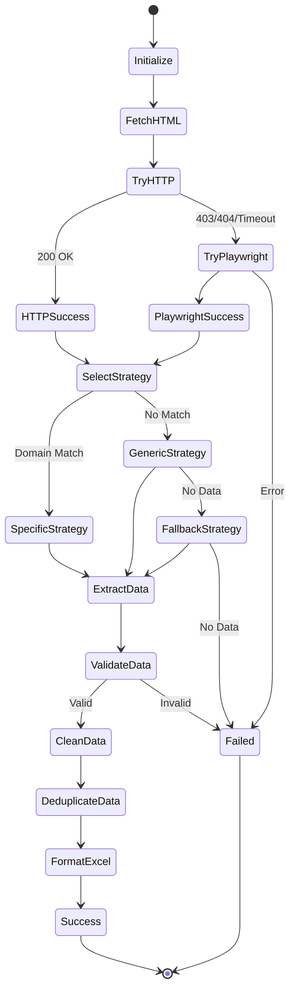

# 📊 Dealer Scraper - Professional Diagrams

**These diagrams will render as beautiful graphics on GitHub!**

---

## 🔄 How the App Works - User Flow

---

## 🏗️ System Architecture

---

## 📦 Data Flow Process

---

## 🚀 Deployment Flow

---

## 📁 File Structure Overview

---

## 🔀 Strategy Selection Logic

---

## 📊 Component Dependencies

---

## 🎯 Scraping Success Flow

---

## 💾 Data Structure Flow

```mermaid
graph LR
    subgraph Input
        A[Raw HTML]
    end
    
    subgraph Extraction
        B[Strategy Extracts]
        C[Raw Dictionaries]
    end
    
    subgraph Cleaning
        D[Validate Fields]
        E[Parse Addresses]
        F[Remove Duplicates]
    end
    
    subgraph Formatting
        G[pandas DataFrame]
        H[Add Columns]
        I[Sort & Order]
    end
    
    subgraph Output
        J[Excel File]
    end
    
    A --> B
    B --> C
    C --> D
    D --> E
    E --> F
    F --> G
    G --> H
    H --> I
    I --> J
    
    style A fill:#ffebee
    style C fill:#fff3e0
    style F fill:#e8f5e9
    style G fill:#e3f2fd
    style J fill:#f3e5f5
```

---

## 📝 Notes

**Viewing These Diagrams:**

1. **On GitHub:** These diagrams render automatically as beautiful graphics
2. **In VS Code:** Install "Markdown Preview Mermaid Support" extension
3. **Export as Images:** Use GitHub's export feature or Mermaid Live Editor

**Editing Diagrams:**

- Diagrams are in Mermaid syntax (text-based)
- Easy to edit and update
- Can be version controlled
- GitHub renders them beautifully

**Links:**
- Mermaid Documentation: https://mermaid.js.org/
- Mermaid Live Editor: https://mermaid.live/
- Export as PNG/SVG from GitHub or Mermaid Live

---

**These diagrams provide visual representations of:**
✅ User interaction flow  
✅ System architecture  
✅ Data processing pipeline  
✅ Deployment workflow  
✅ File structure  
✅ Strategy selection logic  
✅ Component dependencies  
✅ State transitions  
✅ Data transformations  

